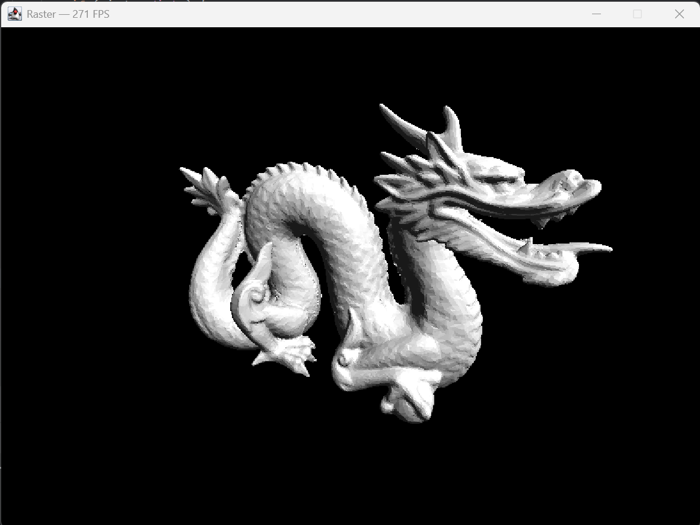

# Raster

Software 3D Renderer.

* Left Click + Drag - Move mesh across the screen.
* Right Click + Drag - Rotate mesh in xy plane
* Ctrl + Right Click + Drag - Rotate mesh around z axis
* Escape - Clear Texture
* Space - Toggle Wireframe
* Enter - Capture Screenshot

## Features

* Textures
* Parallel Processing
* Face Culling
* Triangle/Line Rasterization
* Vertex/Fragment Shaders
* GUI with `.obj` and texture drag and drop

 

---

 

